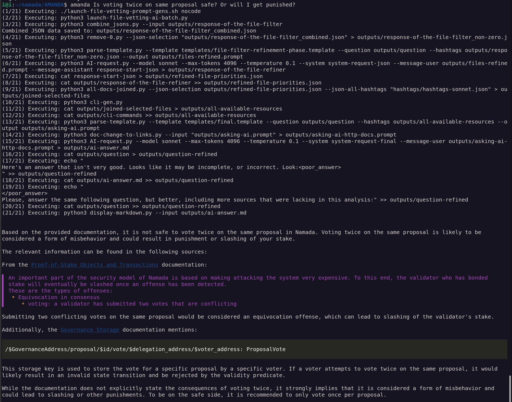

# AMANDA

Amanda is an AI assistant that answers questions about the Namada blockchain. It can help find out how to use Namada or develop with it. With some skill, you can extend Amanda to know more information than it does right out of the box and even to integrate it with your own project. To provide an example and also to code for other often-used-together tools beside `namada`, some information on `osmosisd` and `gaiad` CLI was also scanned and added to knowledge base by default. Adding unnecessary things into AI analysis, though, makes AI requests more expensive and less effective at finding the information you need, so take that into account.

## Quickstart

Check it out real fast in Google Colab. Also, Colab a good environment to run Amanda via web, even though the markdown there is suboptimal.
[](https://colab.research.google.com/drive/141H_D1Y-9gYEACeiGZ7197k9Of1G9Dn3?usp=sharing)


## Install

Tested on Ubuntu Linux, to be tested on MacOS.

```bash
git clone https://github.com/ibmua/amanda.git
cd amanda
export AMANDA_FOLDER=$(pwd)
chmod +x *.sh

```
if using claude.ai API:
```bash
export AMANDA_API="anthropic"
export CLAUDE_API_KEY="sk-ant-api03-Fp1uQ....your-api-key-goes-here"
```

Otherwise, if using Google Cloud Vertex AI API (read on that below):
```bash
export AMANDA_API="google"
export GOOGLE_PROJECT_ID="...your-google-cloud-project-ID"
```

And then after after API settings, we install amanda:

```bash
sudo ./amanda-install.sh
```

The script will create `amanda` executable and make it accessible via `amanda` command from anywhere inside the terminal. It will remember current folder as `AMANDA_FOLDER` environment variable and remember currently set API env variables `AMANDA_API`, `CLAUDE_API_KEY` and `GOOGLE_PROJECT_ID`.

To switch to using a different API you will need to rerun the install script after updating the environment variables appropriately.

```bash
export AMANDA_API=".."

cd $AMANDA_FOLDER
./amanda-install.sh
```

## Use

```bash
amanda How to blah blah?
```

Or, though it should work worse, your can include searching through codebase with:

```bash
amanda --code How do I blah blah?
```

Do note, that as of April 2024 Claude 3 models are very freshly out and the API is basically like a spotty hotel WiFi connection. It is expected to scale and improve in the coming months and it should begin to work in a stable dependable fashion and accept higher request quotas. Right now you may encounter errors due to curent very strict token limitations and API errors. This is usually not a problem with the app, but with the temporary limitations and problems with the API. Also, as LLM AIs get smarter, cheaper and faster, it will be possible to get to better answers cheaper.

## AI API

Expected environment variables:
```
AMANDA_API      API to use: "anthropic" or "google" (default: "anthropic")
if AMANDA_API=anthropic -> CLAUDE_API_KEY  Anthropic API key
if AMANDA_API=google -> GOOGLE_PROJECT_ID Google Cloud project ID (required when using the Google API)
```

Amanda is designed to use Claude.ai, though you can use a different AI API if you modify the code appropriately. 

You can use Claude AI API either directly, or use it via Google Cloud (at the moment, the most powerful - Opus model - is not available via GCP, though). Directly registering to get Claude API at https://console.anthropic.com/ is by far the easier option. When you'll register and generate an API key, you should set your CLAUDE_API_KEY.


### Claude.ai API

```bash
export AMANDA_API="anthropic"
export CLAUDE_API_KEY="sk-ant-api03-Fp1uQ...."
```

and the scripts will use your API key to perform the AI queries. AI queries cost some money - pricing here: https://www.anthropic.com/api , so your Claude API account should be funded. Free $5 credits Claude.ai offers as an incentive is fine, if they still do.


### Google Compute Platform

Alternatively, you can use Claude indirectly via GCP. You'll need to install relevant things to use Google Vertex AI API. And you have to have a Google Compute Platform account. And then you will need to enable Claude API for a relevant model, for example Claude Sonnet here https://console.cloud.google.com/vertex-ai/publishers/anthropic/model-garden/claude-3-sonnet or Haiku here https://console.cloud.google.com/vertex-ai/publishers/anthropic/model-garden/claude-3-haiku.
```bash
sudo apt-get update
pip install -U anthropic[vertex]
sudo apt-get install apt-transport-https ca-certificates gnupg curl
curl https://packages.cloud.google.com/apt/doc/apt-key.gpg | sudo gpg --dearmor -o /usr/share/keyrings/cloud.google.gpg
echo "deb [signed-by=/usr/share/keyrings/cloud.google.gpg] https://packages.cloud.google.com/apt cloud-sdk main" | sudo tee -a /etc/apt/sources.list.d/google-cloud-sdk.list
sudo apt-get update && sudo apt-get install google-cloud-cli
gcloud auth application-default login
```


## ELI5 how Amanda works, please

1. Documents, such as important code, documentation and selected blog posts are scanned and are tagged by AI (Claude.ai is used). `namada` CLI is scanned for all of the commands available in CLI. If you want, you can integrate your own files to be scanned by Amanda. You can also modify some script request parameters, or the scripts themselves, to index other folders and CLIs. Mostly, the scripts are automagically modifiable by feeding them along with your modification requests to Claude.ai's Claude Opus chatbot.

2. When a user asks a question, an AI is given a question and asked to help figure out which resources should be requested in order to answer it. It's provided with this question along with an array of available tags and namada CLI commands with descriptions of their functionality. It's then supposed to list us the resources that will be helpful.

3. Such helpful documentation is compiled along with the question prompt and fed to an LLM that tries to answer the question.


## The Algorithm

This is how the cake was baked. You might need to use some of these to get the AI knowledge base up to date, as Namada updates, or to add your own custom information to the knowledge base.

First, we generate hashtags for files such as docs, sources, blogposts. You can also add your own project folder to the list to integrate it into AI knowledge base. Resulting hashtags will help AI determine which files are important to read in order to answer the user's question.

One possible problem we might run into is that as of April 2024, Claude API (at least, for non-Google Vertex access), might have a low daily limit for a starting user, or other problems with Claude API being limited in it's current capacity, for example hitting `anthropic.InternalServerError: Error code: 529 - {'type': 'error', 'error': {'type': 'overloaded_error', 'message': 'Overloaded'}}` at some point (in which case, just restart `AI-hashtag-generator.py` after a few seconds).

### Preparing / updating

```bash
cd $AMANDA_FOLDER/namada-src
git clone https://github.com/anoma/namada.git
git clone https://github.com/anoma/namada-docs.git
cd $AMANDA_FOLDER

python3 AI-hashtag-generator.py --folders namada-src/ .mdx,.md,.rs  supplemental-materials/ "*"  --output hashtags/hashtags-sonnet.json --ignore CHANGELOG.md --model sonnet --api anthropic --truncate
python3 move-hashtags-to-smaller-jsons.py --input hashtags/hashtags-sonnet.json --output hashtags/feed-to-ai.json --output-nocode hashtags/feed-to-ai-nocode.json
```

Parse help for CLI tools using:

```bash
python3 namada-cli-help-parser.py --output-full help/namada-help.json --output-description help/help-descriptions-only.json --commands namada osmosisd
python3 cli-add-ids.py  --input help/help-descriptions-only.json  --output help/help-descriptions-and-ids.json
```

We'll be referencing the following files for convenience in the future:

```bash
echo "You need to write a minified JSON with 0 or 1 next to ID's of files depending on whether their contents should be included in analysis, or not." > system-request-json
echo '{' > response-start-json
echo 'Use provided resources to answer the question.' > system-request-final
```


### Running

Now when we have a question to ask the AI, what happens underneath the hood is:

1. We first store it in `question` file.

```bash
echo "How to perform shielded token transfer to a different chain?" > outputs/question
```

2. Then we build a request for related files

Notice the optional nocode argument. It ensures we don't include code amoung the files we look into. Looking into code is a generally a bad idea, because of how heavy the source files are. But if you need to include code in your AI knowledge base, you can.

```bash
./launch-file-vetting-prompt-gens.sh nocode
```

What is happenning under the hood is this runs:

```bash
python3 parse-template.py  --template templates/file-filter-request.template  --question outputs/question  --hashtags hashtags/feed-to-ai.json.0  --output outputs/file-filter.prompt.0
```

 for all the feed-to-ai.json hashtag files. This is because it's best for us to have divided all of the files into batches and to make several requests instead of a single very big request to the AI.


3. We request Claude AI with this request and store a result.

```bash
python3 launch-file-vetting-ai-batch.py
python3 combine_jsons.py --input outputs/response-of-the-file-filter
```
Again, what happens under the hood is multiple times the AI is prompted with different parts of the file database
```bash
python3 AI-request.py --model haiku --max-tokens 4096 --temperature 0.1 --system system-request-json --message-user outputs/file-filter.prompt.0 --message-assistant response-start-json --api anthropic > outputs/response-of-the-file-filter.0
```

and then the JSONs get combined.

4. We need to refine our selection of files, as the AI often marks too many files as relevant for us to include.

```bash
python3 remove-0.py  --json-selection "outputs/response-of-the-file-filter_combined.json"  >  outputs/response-of-the-file-filter_non-zero.json
python3 parse-template.py  --template templates/file-filter-refinement-phase.template  --question outputs/question  --hashtags outputs/response-of-the-file-filter_non-zero.json  --output outputs/files-refined.prompt
python3 AI-request.py --model sonnet --max-tokens 4096 --temperature 0.1 --system system-request-json --message-user outputs/files-refined.prompt --message-assistant response-start-json --api anthropic > outputs/response-of-the-file-refiner
cat response-start-json > outputs/refined-file-priorities.json
cat outputs/response-of-the-file-refiner >> outputs/refined-file-priorities.json
python3 all-docs-joined.py  --json-selection outputs/refined-file-priorities.json  --json-all-hashtags "hashtags/hashtags-sonnet.json"  >  outputs/joined-selected-files
```

4. Then we request for any CLI help information that might be of interest.

What we basically do underneath is something like:
```bash
python3 parse-template.py  --template templates/cli.template  --question outputs/question  --hashtags help/help-descriptions-and-ids.json  --output outputs/cli.prompt
python3 AI-request.py --model haiku --max-tokens 4096 --temperature 0.1 --system system-request-json --message-user outputs/cli.prompt --message-assistant response-start-json --api anthropic > outputs/about-cli.response
cat response-start-json > outputs/about-cli-response.json
cat outputs/about-cli.response >> outputs/about-cli-response.json
python3 cli-picked-useful.py --cli-response-json outputs/about-cli-response.json --cli-desc-and-ids-json help/help-descriptions-and-ids.json --full-cli-json help/namada-help.json
```

But, because of the 4096-token output limitation of Claude API, we may have to split this into many requests. So what we do is we launch a script that iterates and pieces things together:

```bash
python3 cli-gen.py
```

5. Now we combine all of the resources we expect to be useful and we feed it to AI along with the question. And retrieve the answer.

```bash
cat outputs/joined-selected-files > outputs/all-available-resources
cat outputs/cli-commands >> outputs/all-available-resources
python3 parse-template.py  --template templates/final.template  --question outputs/question  --hashtags outputs/all-available-resources  --output outputs/asking-ai.prompt
python3 doc-change-to-links.py --input "outputs/asking-ai.prompt" > outputs/asking-ai-http-docs.prompt
python3 AI-request.py --model sonnet --max-tokens 4096 --temperature 0.1 --system system-request-final --message-user outputs/asking-ai-http-docs.prompt --api anthropic > outputs/ai-answer.md
python3 display-markdown.py --input outputs/ai-answer.md
```


### Refined answer

It is possible to iterate once more, or even several times and refine the answer even more if the user so desires.

```bash 
-- perform same stuff as above ---
cat outputs/question > outputs/question-refined
echo -e "\nHere's an answer that needs to be improved and rewritten:\n" >> outputs/question-refined
cat outputs/ai-answer.md >> outputs/question-refined
echo -e "\nPlease, answer the same following question, but better:" >> outputs/question-refined
cat outputs/question >> outputs/question-refined
cat outputs/question-refined > outputs/question
repeat
```

```bash 
echo "How to perform shielded token transfer to Osmosis?" > outputs/question
python3 full-cycle.py --nocode
cat outputs/question-refined > outputs/question
python3 display-markdown.py --input outputs/ai-answer.md
python3 full-cycle.py --nocode
cat outputs/question-refined > outputs/question
python3 display-markdown.py --input outputs/ai-answer.md
```


### Google's API for Claude

```bash
gcloud auth login
gcloud iam service-accounts list --project aboqetest

python3 AI-request.py --model haiku --max-tokens 4096 --temperature 0.1 --system system-request-final --message-user outputs/asking-ai-http-docs.prompt --api google > outputs/ai-answer.md
```


### Example 1
```bash
amanda Is voting twice on same proposal safe? Or will I get punished?
```



#### Answer:


### Example 2
```bash
amanda I want to transfer from addr tnam1qxy9qez7f63rly36suw08z65ur9e2lfspcgzp4uy 1000 NAAN to osmo1xl7pamcuf8pnnrx58kq4gyuzwk6hg67r87eujw and make it in an anonymous manner. Please, write step-by-step all I gotta do
```
#### Answer:

To transfer 1000 NAAN from the address `tnam1qxy9qez7f63rly36suw08z65ur9e2lfspcgzp4uy` to `osmo1xl7pamcuf8pnnrx58kq4gyuzwk6hg67r87eujw` in an anonymous manner, you can follow these steps:

1. **Generate a shielded payment address**

First, you need to generate a shielded payment address from your spending key. You can do this using the `namadaw` wallet command:

```
namadaw gen-payment-addr --alias <payment-address-alias> --key <your-spending-key-alias>
```

Replace `<payment-address-alias>` with an alias for the new payment address, and `<your-spending-key-alias>` with the alias of your spending key in the wallet. You can find instructions on generating spending keys and payment addresses in the [Shielded Transfers documentation](https://docs.namada.net/users/shielded-accounts/shielded-transfers).

2. **Shield the NAAN tokens**

Next, you need to shield your NAAN tokens by transferring them from the transparent address to the shielded payment address you just generated. You can do this using the `namadac` client command:

```
namadac transfer \
  --source tnam1qxy9qez7f63rly36suw08z65ur9e2lfspcgzp4uy \
  --target <your-shielded-payment-address> \
  --token NAAN \
  --amount 1000 \
  --signing-keys <your-transparent-key>
```

Replace `<your-shielded-payment-address>` with the shielded payment address you generated in step 1, and `<your-transparent-key>` with the alias of the key associated with the source address in your wallet.

3. **Generate a shielded IBC transfer**

Once your NAAN tokens are shielded, you can generate a shielded IBC transfer to the Osmosis chain using the `namadac ibc-gen-shielded` command:

```
namadac ibc-gen-shielded \
  --target osmo1xl7pamcuf8pnnrx58kq4gyuzwk6hg67r87eujw \
  --token NAAN \
  --amount 1000 \
  --port-id transfer \
  --channel-id <channel-id> \
  --output-folder-path <output-folder> \
  --node <namada-node-address>
```

Replace `<channel-id>` with the appropriate channel ID for the IBC transfer from Namada to Osmosis, `<output-folder>` with the path to a folder where the transfer artifact will be stored, and `<namada-node-address>` with the address of a Namada node (e.g., `http://localhost:26657`).

This command will generate a file containing the necessary data for a shielded IBC transfer, where the source address (your shielded payment address) is not revealed on the Osmosis chain.

4. **Submit the shielded IBC transfer**

To submit the shielded IBC transfer, you need to use the `namadac ibc-transfer` command with the `--memo-path` flag pointing to the file generated in step 3:

```
namadac ibc-transfer \
  --source <your-spending-key-alias> \
  --receiver osmo1xl7pamcuf8pnnrx58kq4gyuzwk6hg67r87eujw \
  --token NAAN \
  --amount 1000 \
  --channel-id <channel-id> \
  --signing-keys <your-spending-key-alias> \
  --memo-path <path-to-transfer-artifact> \
  --node <namada-node-address>
```

Replace `<your-spending-key-alias>` with the alias of your spending key in the wallet, `<channel-id>` with the appropriate channel ID, `<path-to-transfer-artifact>` with the path to the file generated in step 3, and `<namada-node-address>` with the address of a Namada node.

This command will submit the shielded IBC transfer, where the tokens will be transferred anonymously from your shielded payment address to the specified Osmosis address.

Note: The [Shielded Actions documentation](https://docs.namada.net/users/shielded-accounts/shielded-actions) mentions that shielded actions like this are not yet fully implemented, so some details may change in the future. Additionally, I don't have specific information on the channel ID or other configuration details required for this transfer, as those details are not provided in the documentation.

Sources:
- [Namada Docs: Shielded Transfers](https://docs.namada.net/users/shielded-accounts/shielded-transfers)
- [Namada Docs: IBC Transfers](https://docs.namada.net/users/ibc)
- [Namada CLI Help: `namadaw gen-payment-addr`](https://docs.namada.net/integrating-with-namada/sdk/constructing-transfers#shielded-transfers)
- [Namada CLI Help: `namadac transfer`](https://docs.namada.net/users/shielded-accounts/shielded-transfers#shielding-transfers)
- [Namada CLI Help: `namadac ibc-gen-shielded`](https://docs.namada.net/users/ibc#shielding-transfer)
- [Namada CLI Help: `namadac ibc-transfer`](https://docs.namada.net/users/ibc#shielding-transfer)


# License

Standart MIT License.

